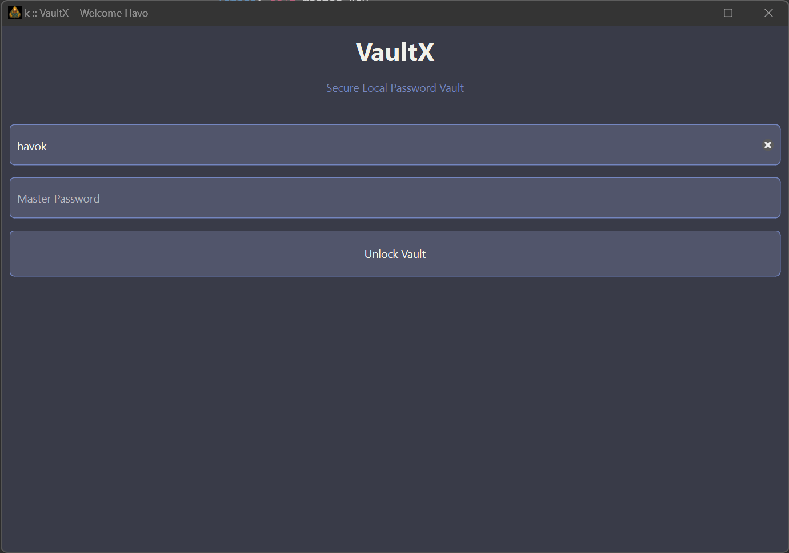
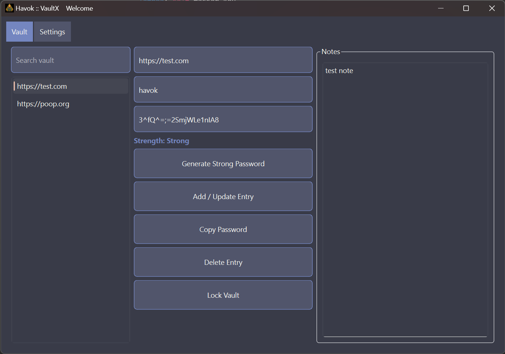

# 🔐 VaultX

**VaultX** is a local-first, offline password manager built with Python and PySide6.  
No cloud. No sync. No telemetry. No nonsense.

If you want a clean, fast, encrypted vault that lives entirely on *your* machine, this is it.

---

## ✨ Features

- 🔒 **Strong cryptography**
  - PBKDF-based key derivation
  - HMAC verification
  - Encrypted vault storage
- 🖥️ **Native desktop UI**
  - Built with PySide6 (Qt)
  - Fast startup, no browser garbage
- 🧠 **Auto-locking**
  - Locks after inactivity
  - Optional lock on window blur
- ⌨️ **Global hotkey**
  - Instantly bring VaultX to the foreground
- 📋 **Secure clipboard**
  - Auto-clears after timeout
- 📴 **Offline-first**
  - No network access
  - No external services
- 🧱 **Single-file build**
  - Packaged with PyInstaller
  - Easy distribution

---

## 🖼️ Screenshots

### 🔑 Login Screen


### 🗄️ Vault View


---

## 🧱 Architecture Overview

```
VaultX/
├── main.py                # App entry point
├── config.py              # Global configuration
├── crypto/                # Key derivation + encryption
│   ├── kdf.py
│   └── cipher.py
├── storage/               # Encrypted vault persistence
│   └── vault.py
├── models/                # Data models
│   └── entry.py
├── ui/                    # PySide6 UI components
│   ├── login.py
│   ├── vault_view.py
│   ├── settings_view.py
│   └── theme.qss
├── utils/                 # Clipboard, hotkeys, helpers
│   ├── clipboard.py
│   ├── hotkey.py
│   └── password_gen.py
├── icon/                  # App icons
│   ├── content.png
│   └── content.ico
└── VaultX.spec            # PyInstaller build spec
```

---

## 🚀 Running from Source

### Requirements
- Python 3.11+
- Windows, Linux, or macOS

### Install dependencies
```bash
pip install -r requirements.txt
```

### Run
```bash
python main.py
```

---

## 📦 Building a Single Executable (Windows)

```bash
pyinstaller --onefile --windowed ^
  --name VaultX ^
  --icon icon\content.ico ^
  --add-data "icon;icon" ^
  --add-data "ui;ui" ^
  --add-data "crypto;crypto" ^
  --add-data "models;models" ^
  --add-data "storage;storage" ^
  --add-data "utils;utils" ^
  main.py
```

Output will be in:
```
dist/VaultX.exe
```

---

## 🔐 Security Model (Short Version)

- Master password **never stored**
- Key derived with per-user salt
- Username and verifier protected with HMAC
- Clipboard auto-clears
- Memory cleared on lock

This is a **local vault**, not a cloud service.  
If someone owns your machine, they own everything. That’s reality, not a bug.

---

## 🧭 Philosophy

VaultX is intentionally:
- Simple
- Auditable
- Offline
- Opinionated

No accounts.  
No sync.  
No upsell.  
No tracking.

Just a vault.

---

## 📜 License

MIT License.  
Do whatever you want. Just don’t pretend you wrote it.

---

## ⚠️ Disclaimer

This project is for personal use and learning.  
Review the code before trusting it with secrets you can’t afford to lose.

Cryptography is hard. Hubris is harder.

---

**Built by someone who doesn’t trust browsers with passwords.**
